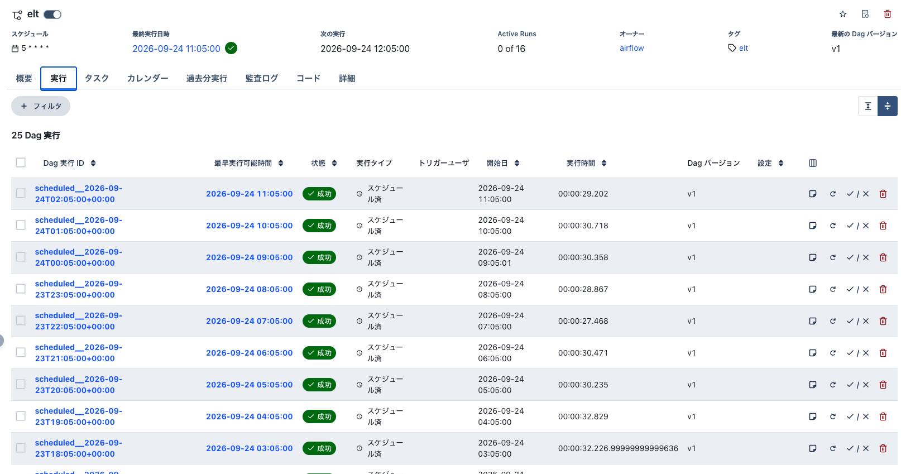
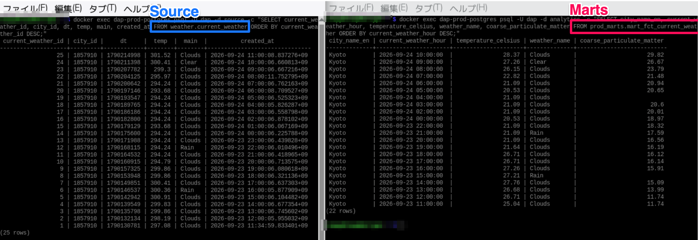

# README

Small Data Analytics Platform は、データ分析基盤の仕組みを「小さく作って理解する」ための学習用プロジェクトです。

OpenWeather API からデータを取得し、PostgreSQL に保存。dlt で分析用DBへロードし、dbt で staging / intermediate / marts にモデリング。Airflow で一連のELTをオーケストレーションします。

Docker / Dev Containers で各コンポーネントを分離し、手元で確認しながら、壊しながら小さなデータ分析基盤を作成できます。

## データパイプラインとアーキテクチャ

実行する環境がRaspberryPiということもあり、1つのPostgreSQLで3つのデータベースを管理しています。
Ingestionの部分は、日々、データが蓄積される基幹システムを模しているため、Airflowでは管理していません。
また、dbtで作成しているモデルも特に意図はなく、raw から marts までが生成されることを目的にしています。

本プロジェクトは、データ分析基盤の仕組みを「小さく作って理解する」ことを目的とした学習用です。
そのため、セキュリティや監視、詳細なログなど本番運用で必須となる機能は、簡易的な実装のみです。

### Airflow Scheduler

### SourceDBとMart

※ 無料アカウントの場合、OpenWeather API は1時間ごとに更新されるわけではないため、左のSourceDBへは毎時0分でインサートされていますが、Martのテーブルは時間単位でGROUP BYしているため行数は一致していません。
