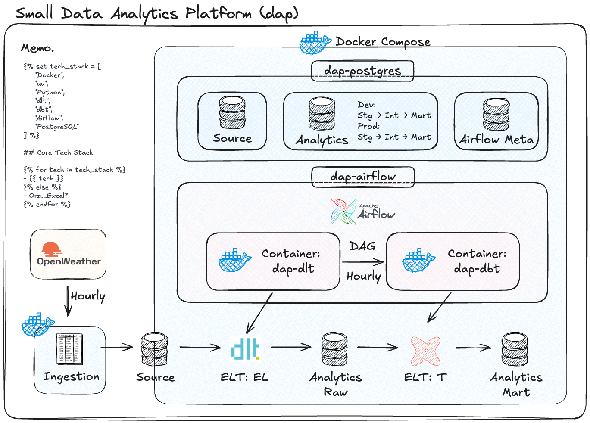

# README

Small Data Analytics Platform は、データ分析基盤の仕組みを「小さく作って理解する」ための学習用プロジェクトです。

OpenWeather API からデータを取得し、PostgreSQL に保存。dlt で分析用DBへロードし、dbt で staging / intermediate / marts にモデリング。Airflow で一連のELTをオーケストレーションします。

Docker / Dev Containers で各コンポーネントを分離し、手元で確認しながら、壊しながら小さなデータ分析基盤を作成できます。

## Data pipeline architecture

実行する環境がRaspberryPiということもあり、1つのPostgreSQLで3つのデータベースを管理している。
また、Ingestionの部分は、日々、データが蓄積される基幹システムを模しているため、Airflowでは管理していない。

