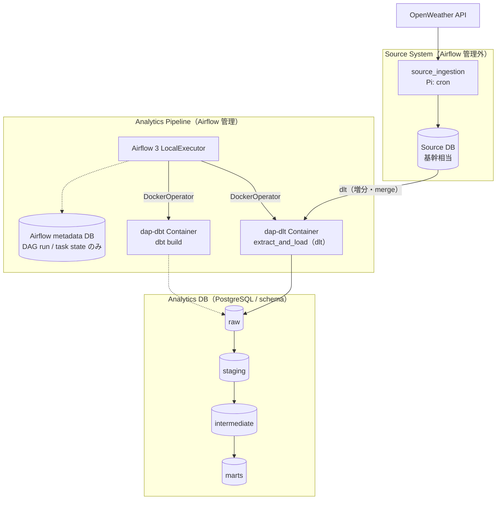
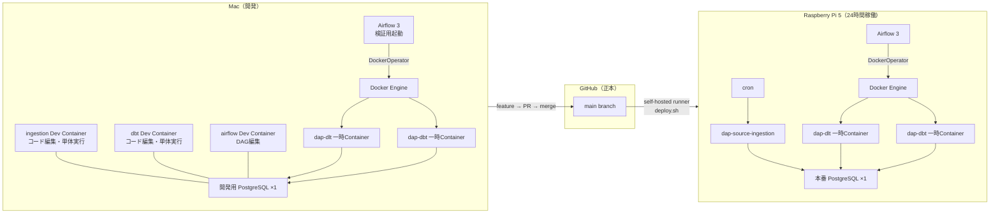

# SmallDataAnalyticsPlatform

## データパイプライン

```mermaid
flowchart TB
  API["OpenWeather API"]

  subgraph SourceSystem["Source System（Airflow 管理外）"]
    ING["source_ingestion<br/>Pi: cron"]
    SRC[("Source DB<br/>基幹相当")]
    ING --> SRC
  end

  subgraph Orchestration["Analytics Pipeline（Airflow 管理）"]
    AF2["Airflow 3 LocalExecutor"]
    EL["dap-dlt Container<br/>extract_and_load（dlt）"]
    DBT["dap-dbt Container<br/>dbt build"]
    META[("Airflow metadata DB<br/>DAG run / task state のみ")]
    AF2 -->|"DockerOperator"| EL
    AF2 -->|"DockerOperator"| DBT
    AF2 -.-> META
  end

  subgraph AnalyticsDB["Analytics DB（PostgreSQL / schema）"]
    direction LR
    RAW[("raw")]
    STG[("staging")]
    INT[("intermediate")]
    MART[("marts")]
    RAW --> STG
    STG --> INT
    INT --> MART
  end

  API --> ING
  SRC -->|"dlt（増分・merge）"| EL
  EL --> RAW
  DBT -.-> RAW
```

## 環境とデプロイの関係（統合検証 / 本番相当）

```mermaid
flowchart LR
  subgraph MacLate["Mac（開発）"]
    DC_I2["ingestion Dev Container<br/>コード編集・単体実行"]
    DC_D2["dbt Dev Container<br/>コード編集・単体実行"]
    DC_A2["airflow Dev Container<br/>DAG編集"]
    AF_M["Airflow 3<br/>検証用起動"]
    ENG_M["Docker Engine"]
    EL_M["dap-dlt 一時Container"]
    DBT_M["dap-dbt 一時Container"]
    PG2["開発用 PostgreSQL ×1"]
    DC_I2 --- PG2
    DC_D2 --- PG2
    DC_A2 --- PG2
    AF_M -->|"DockerOperator"| ENG_M
    ENG_M --> EL_M
    ENG_M --> DBT_M
    EL_M --> PG2
    DBT_M --> PG2
  end

  subgraph GH2["GitHub（正本）"]
    MAIN2["main branch"]
  end

  subgraph Pi["Raspberry Pi 5（24時間稼働）"]
    CRON["cron"]
    SRC_IMG["dap-source-ingestion"]
    AF["Airflow 3"]
    ENGINE["Docker Engine"]
    EL_IMG["dap-dlt 一時Container"]
    DBT_IMG["dap-dbt 一時Container"]
    PG_PRD["本番 PostgreSQL ×1"]
    CRON --> SRC_IMG --> PG_PRD
    AF -->|"DockerOperator"| ENGINE
    ENGINE --> EL_IMG
    ENGINE --> DBT_IMG
    EL_IMG --> PG_PRD
    DBT_IMG --> PG_PRD
  end

  MacLate -->|"feature → PR → merge"| MAIN2
  MAIN2 -->|"self-hosted runner<br/>deploy.sh"| Pi
```
